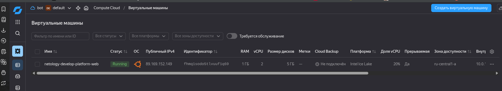
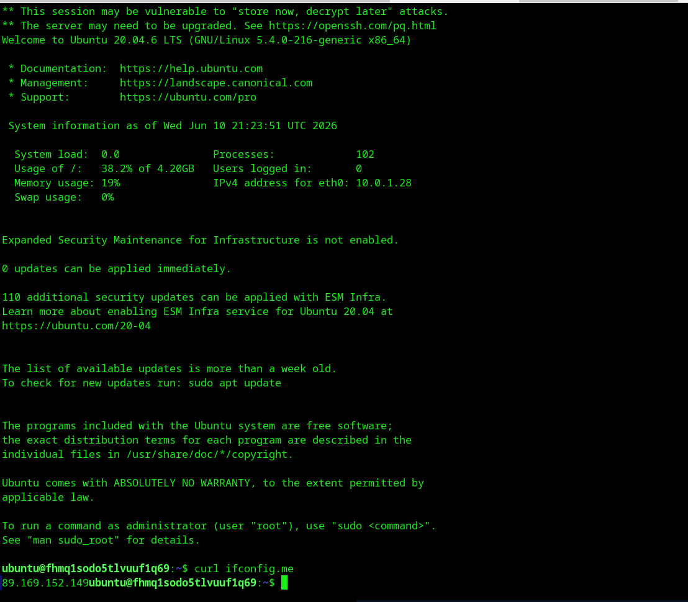
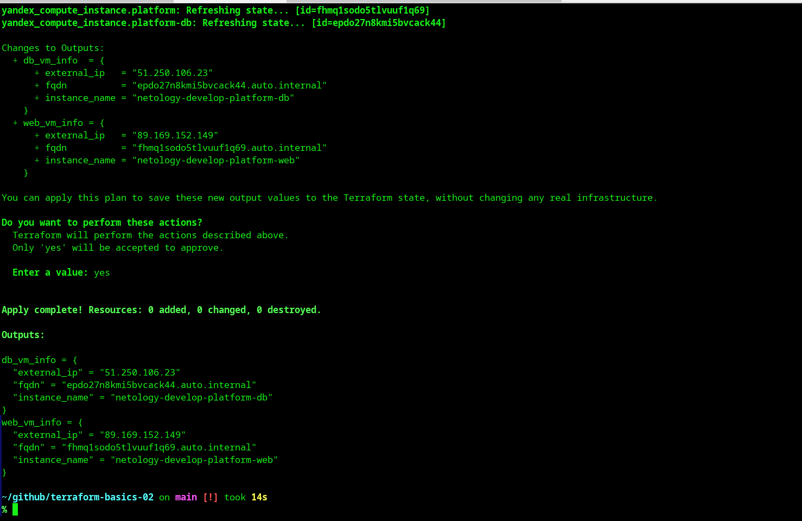

# Домашнее задание: Основы Terraform. Yandex Cloud

## Описание

Выполнение домашнего задания по основам работы с Terraform в облаке Yandex Cloud. В рамках задания создаются виртуальные машины с использованием Infrastructure as Code подхода.

## Выполненные задания

### Задание 1: Создание первой ВМ

- [x] Изучен проект и исходный код
- [x] Создан сервисный аккаунт и ключ для аутентификации Terraform
- [x] Настроен SSH-ключ для доступа к ВМ
- [x] Исправлены намеренные синтаксические ошибки:
  - Опечатка в названии платформы (`standart-v4` → `standard-v3`)
  - Несуществующая версия Terraform (`~>1.12.0` → `~>1.8.0`)
- [x] Инициализирован проект и созданы ресурсы
- [x] Подключился к ВМ по SSH и проверил внешний IP

**Результат:**
- Создана ВМ `netology-develop-platform-web`
- Внешний IP: `89.169.152.149`
- Скриншоты:
  - 
  - 

#### Ответы на вопросы

**Вопрос 4: В чём заключается суть намеренно допущенных синтаксических ошибок?**

В коде были допущены следующие ошибки:
1. **Опечатка в названии платформы** (`standart-v4` вместо `standard-v3`) — это логическая ошибка в значении аргумента. Terraform синтаксически корректно примет такой код, но Yandex Cloud API отвергнет его, так как платформы с названием "standart-v4" не существует.
2. **Несуществующая версия Terraform** (`required_version = "~>1.12.0"`) — на момент выполнения задания версии 1.12.0 не существует, что приведёт к ошибке при инициализации проекта (`terraform init`).

**Вопрос 6: Как в процессе обучения могут пригодиться параметры `preemptible = true` и `core_fraction=5`?**

- **`preemptible = true`** — создаёт прерываемую виртуальную машину, которая автоматически останавливается через 24 часа или когда облаку нужны ресурсы. Это дешевле (до 70-80% экономии), что идеально подходит для учебных целей, тестирования и экспериментов, когда не требуется постоянная работа ВМ.
- **`core_fraction=20`** — ограничивает гарантированную производительность vCPU до 20% от базовой частоты. Это тоже снижает стоимость и подходит для обучения, когда не нужны высокие вычислительные мощности (достаточно для базовых команд, установки ПО, тестов).

Оба параметра позволяют экономить бюджет при обучении и тестировании Terraform-конфигураций.

---

### Задание 2: Замена хардкода на переменные

- [x] Заменены хардкод-значения для ресурсов на переменные
- [x] Добавлены переменные с префиксом `vm_web_`
- [x] Проверено через `terraform plan` (изменений нет)

**Результат:**
```
terraform plan показал: "No changes. Your infrastructure matches the configuration."
```

**Файлы:**
- `variables.tf` — добавлены переменные: vm_web_name, vm_web_platform_id, vm_web_cores, vm_web_memory, vm_web_core_fraction, vm_web_image_family
- `main.tf` — используются переменные вместо хардкода

---

### Задание 3: Создание второй ВМ

- [x] Создан файл `vms_platform.tf`
- [x] Перенесены переменные первой ВМ с префиксом `vm_web_`
- [x] Создана вторая ВМ `netology-develop-platform-db`
- [x] Параметры: cores=2, memory=2, core_fraction=20, зона `ru-central1-b`
- [x] Создана вторая подсеть `develop-b` в зоне `ru-central1-b` (CIDR: 10.0.2.0/24)

**Результат:**
- Создана ВМ `netology-develop-platform-db`
- Внешний IP: `51.250.106.23`
- Зона доступности: `ru-central1-b`
- Платформа: `standard-v3`, 2 ядра, 2 ГБ RAM

**Файлы:**
- `vms_platform.tf` — переменные для обеих ВМ (vm_web_* и vm_db_*)
- `main.tf` — добавлен ресурс второй подсети и ВМ

---

### Задание 4: Настройка outputs

- [x] Создан файл `outputs.tf`
- [x] Настроены outputs для instance_name, external_ip, fqdn обеих ВМ
- [x] Использована интерполяция (без хардкода)

**Результат:**
- web_vm_info: external_ip=89.169.152.149, fqdn=fhmq1sodo5t1vuuf1q69.auto.internal
- db_vm_info: external_ip=51.250.106.23, fqdn=epdo27n8kmi5bvcack44.auto.internal

**Скриншот:**
- 

---

### Задание 5: Использование locals

- [x] Создан файл `locals.tf`
- [x] Описаны локальные переменные с интерполяцией (vpc_name + zone)
- [x] Переменные ВМ заменены на locals

**Результат:**
- vm_web_name = "develop-ru-central1-a-web"
- vm_db_name = "develop-b-db"
- Имена ВМ успешно обновлены без пересоздания

---

### Задание 6: Объединение переменных в map

- [x] Создана map-переменная `vms_resources` с конфигурацией обеих ВМ
- [x] Создана map-переменная `metadata` (общая для всех ВМ)
- [x] Закомментированы неиспользуемые переменные
- [x] Код стал более структурированным и поддерживаемым

**Результат:**
- Все параметры ВМ объединены в единую структуру `vms_resources`
- Используется тип `map(object)` для типизации
- Общие метаданные вынесены в отдельную переменную

**Примечание:**
- При рефакторинге одна ВМ была пересоздана (изменился IP с 51.250.106.23 на 51.250.97.229)


---
### Задание 7*: Работа с terraform console

- [x] Изучен файл console.tf
- [x] Выполнены все задания в terraform console

**Результаты:**

1. **Второй элемент списка test_list:**
   ```hcl
   local.test_list[1]
   # Вывод: "staging"
   ```

2. **Длина списка test_list:**
   ```hcl
   length(local.test_list)
   # Вывод: 3
   ```

3. **Значение ключа admin из map test_map:**
   ```hcl
   local.test_map["admin"]
   # Вывод: "John"
   ```

4. **Сложная интерполяция:**
   ```hcl
   "${local.test_map.admin} is admin for production server based on OS ${local.servers.production.image} with ${local.servers.production.cpu} vcpu, ${local.servers.production.ram} ram and ${length(local.servers.production.disks)} virtual disks"
   # Вывод: "John is admin for production server based on OS ubuntu-20-04 with 10 vcpu, 40 ram and 4 virtual disks"
   ```


---

### Задание 8*: Сложная структура данных

- [x] Описана переменная `test` с типом `list(map(list(string)))`
- [x] Значение вынесено в `terraform.tfvars`
- [x] Выполнено извлечение данных через terraform console

**Результат:**

**Объявление переменной (variables.tf):**
```hcl
variable "test" {
  type = list(map(list(string)))
  description = "Complex data structure for task 8*"
  default = []
}
```

**Извлечение SSH-команды:**
```hcl
var.test[0]["dev1"][0]
# Вывод: "ssh -o 'StrictHostKeyChecking=no' ubuntu@62.84.124.117"
```

**Структура данных:**
- `list` — список из 3 элементов
- `map` — каждый элемент содержит имя сервера (dev1, dev2, prod1)
- `list(string)` — значение содержит SSH-команду и внутренний IP

---

### Задание 9*: Настройка NAT Gateway

- [x] Создан NAT Gateway (`yandex_vpc_gateway.nat`)
- [x] Создана таблица маршрутизации с маршрутом через NAT
- [x] Таблица маршрутизации привязана к обеим подсетям
- [x] У ВМ убраны внешние IP (`nat = false`)
- [x] Проверен доступ в интернет через Serial Console

**Результат:**
- ВМ `develop-ru-central1-a-web` имеет внутренний IP `10.0.1.27`
- При выходе в интернет используется IP NAT Gateway: `178.154.236.151`
- ВМ недоступна из интернета напрямую (безопасно!)
- ВМ может скачивать обновления и обращаться к внешним API

**Скриншот:**
- 


---

## Структура проекта

```
terraform-basics-02/
├── main.tf              # Основные ресурсы (ВМ, сеть)
├── variables.tf         # Объявление переменных
├── outputs.tf           # Выводы после apply
├── versions.tf          # Версии Terraform и провайдеров
├── providers.tf         # Конфигурация провайдеров
├── locals.tf            # Локальные переменные
├── console.tf           # Для задания 7*
├── terraform.tfvars     # Значения переменных
├── .gitignore           # Исключения для Git
└── README.md            # Этот файл
```

## Как запустить

### Предварительные требования
- Установлен Terraform ~> 1.8.0
- Установлен Yandex CLI (`yc`)
- Создан сервисный аккаунт и ключ в `~/.yandex/authorized_key.json`
- Создан SSH-ключ в `~/.ssh/id_rsa.pub`

### Запуск
```bash
# Инициализация проекта
terraform init

# Проверка плана изменений
terraform plan

# Применение изменений (создание ресурсов)
terraform apply

# Удаление всех созданных ресурсов
terraform destroy
```

## Технологии
- Terraform
- Yandex Cloud
- SSH

## Автор
Олег Шаров (Myth3916)

## Лицензия
Учебный проект для курса DevOps
